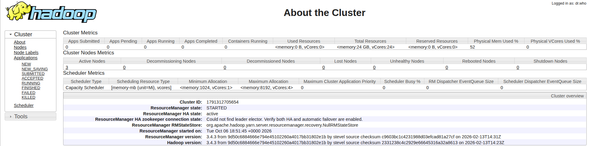
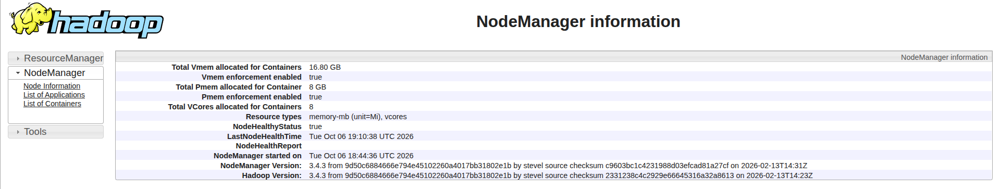
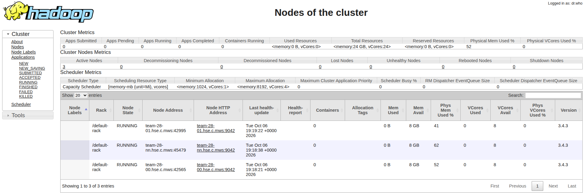

# YARN на кластере Team B

Домашка номер два: поднять YARN поверх HDFS-кластера и опубликовать веб-интерфейсы основных и вспомогательных демонов.

Кластер Team B работает на тех же виртуальных машинах, что и кластер Team A. Ни один файл, процесс или порт Team A не затрагивается.

## Что такое YARN и что мы развернули

HDFS умеет только хранить файлы. YARN умеет считать: он берёт задачу, раздаёт её контейнерам на узлах и собирает результат.

На нашем кластере два демона. ResourceManager - планировщик, он один на весь кластер и живёт на team-28-nn. NodeManager - агент на каждом узле, он запускает контейнеры локально. Нужны были оба: без ResourceManager нодам некуда регистрироваться, без NodeManager никто не будет считать.

В итоге ResourceManager на team-28-nn и три NodeManager, по одному на team-28-nn, team-28-00 и team-28-01.

## Раскладка по узлам

На team-28-nn у нас ResourceManager и NodeManager. На team-28-00 NodeManager. На team-28-01 NodeManager. Внутренние адреса: 10.28.0.11, 10.28.0.12 и 10.28.0.13.

Все демоны YARN работают на тех же узлах, где уже крутится HDFS первой домашки. Там же NameNode, три DataNode и SecondaryNameNode.

Подключение двухступенчатое. С ноутбука идём на edge-узел team-28-en под пользователем team28b, и уже с него переходим внутрь по ключу team28b_internal. Вход всегда явно под team28b.

## Версии

Java - Temurin OpenJDK 11.0.32.1. Hadoop - Apache Hadoop 3.4.3. YARN входит в состав Hadoop, отдельно его ставить не нужно, достаточно правильной настройки.

sudo у пользователя team28b нет, поэтому всё ставится и живёт в домашнем каталоге: ~/apps/java, ~/apps/hadoop. Ничего системного не ставили.

## Порты

Команда A на этих же машинах использует стандартный набор портов YARN. Мы взяли соседний диапазон, чтобы не пересечься, потому что задание у команд одинаковое и они рано или поздно тоже запустят YARN.

ResourceManager Web UI у нас 9088 вместо 8088. NodeManager Web UI 9042 вместо 8042. Планировщик 9030 вместо 8030, трекер ресурсов 9031 вместо 8031, admin 9032 вместо 8032.

Проверка свободных портов перед первым запуском:

ss -ltn | grep -E ':(8088|8042|8030|8031|8032)\b' || echo СВОБОДНЫ

## Настройка

Всё настраивается одним файлом yarn-site.xml в каталоге ~/apps/hadoop/etc/hadoop.

Файл почти одинаков на всех трёх узлах. Разница одна: у каждого узла своё значение yarn.nodemanager.hostname. Если скопировать один конфиг на три машины, ноды не зарегистрируются, поэтому скрипт подставляет значение по имени узла автоматически.

Ключевое свойство - yarn.resourcemanager.resource-tracker.address. По нему NodeManager идёт к ResourceManager. Значение 10.28.0.11:9031.

Здесь пришлось повозиться, и вот почему. На этих виртуальных машинах имя team-28-nn резолвится сразу в два адреса: 10.28.0.11 и 127.0.1.1. Если в свойстве написать имя хоста, процесс возьмёт первый адрес и привяжется к loopback - то есть к самому себе. С внешней машины до такого порта не достучаться.

Поэтому везде, где нужен точный адрес, мы написали IP напрямую, а не имя хоста.

Побочный эффект того же резолвинга: в логе ResourceManager видно, что трекер ресурсов фактически слушает на 127.0.1.1, хотя в свойстве написано 10.28.0.11:9031. Это не мешает работе: ResourceManager принимает соединения, а NodeManager идут по явному адресу 10.28.0.11:9031 и успешно регистрируются. Мы проверяли это отдельно, с обоих внутренних узлов порт достижим.

Также в NodeManager добавлена вспомогательная служба mapreduce_shuffle. Она нужна для перемешивания данных и требуется, если запускать задачи MapReduce. В этой работе задачи не запускались, свойство оставлено на будущее.

## Установка

Ничего доустанавливать не нужно, YARN уже внутри Hadoop. Всё сводится к конфигурации и каталогам.

Готовый скрипт:

./deploy-yarn.sh setup nn
./deploy-yarn.sh setup 00
./deploy-yarn.sh setup 01

Скрипт копирует конфиг на узел, подставляет правильный hostname и создаёт каталоги.

Ручной порядок, если делать без скрипта. Сначала бэкап:

cp ~/apps/hadoop/etc/hadoop/yarn-site.xml ~/apps/hadoop/etc/hadoop/yarn-site.xml.bak

Затем общая часть файла:

cat > ~/apps/hadoop/etc/hadoop/yarn-site.xml << 'EOF'
<?xml version="1.0"?>
<?xml-stylesheet type="text/xsl" href="configuration.xsl"?>
<configuration>
    <property>
        <name>yarn.resourcemanager.resource-tracker.address</name>
        <value>10.28.0.11:9031</value>
    </property>
    <property>
        <name>yarn.nodemanager.resource-tracker.address</name>
        <value>10.28.0.11:9031</value>
    </property>
    <property>
        <name>yarn.resourcemanager.webapp.address</name>
        <value>0.0.0.0:9088</value>
    </property>
    <property>
        <name>yarn.resourcemanager.scheduler.address</name>
        <value>0.0.0.0:9030</value>
    </property>
    <property>
        <name>yarn.resourcemanager.admin.address</name>
        <value>0.0.0.0:9032</value>
    </property>
    <property>
        <name>yarn.nodemanager.webapp.address</name>
        <value>0.0.0.0:9042</value>
    </property>
    <property>
        <name>yarn.nodemanager.poke.address</name>
        <value>0.0.0.0:9041</value>
    </property>
    <property>
        <name>yarn.nodemanager.aux-services</name>
        <value>mapreduce_shuffle</value>
    </property>
</configuration>
EOF

Потом дописываем свой hostname. На team-28-nn:

head -n -1 ~/apps/hadoop/etc/hadoop/yarn-site.xml > ~/yarn.new
cat >> /yarn.new << 'EOF'
    <property>
        <name>yarn.nodemanager.hostname</name>
        <value>team-28-nn</value>
    </property>
</configuration>
EOF
mv /yarn.new ~/apps/hadoop/etc/hadoop/yarn-site.xml

На team-28-00 и team-28-01 то же самое, но в значении свой свой узел.

Проверка после правки:

grep -A1 resource-tracker ~/apps/hadoop/etc/hadoop/yarn-site.xml
grep -A1 nodemanager.hostname ~/apps/hadoop/etc/hadoop/yarn-site.xml

## Запуск

start-yarn.sh не использовали. Он поднимает всё разом по SSH, зависит от workers-файла, а мы запускали демонов вручную - так проще диагностировать, откуда взялась ошибка.

Порядок важен: сначала ResourceManager, потом NodeManager. Ноды не поднимутся, пока планировщика нет.

На team-28-nn:

JAVA_HOME=$HOME/apps/java ~/apps/hadoop/bin/yarn --daemon start resourcemanager

Потом на каждом из трёх узлов свой NodeManager:

JAVA_HOME=$HOME/apps/java ~/apps/hadoop/bin/yarn --daemon start nodemanager

Через скрипт то же самое:

./deploy-yarn.sh start nn
./deploy-yarn.sh start 00
./deploy-yarn.sh start 01

Остановка - только на своём узле, только от team28b, только точечно:

JAVA_HOME=$HOME/apps/java ~/apps/hadoop/bin/yarn --daemon stop resourcemanager
JAVA_HOME=$HOME/apps/java ~/apps/hadoop/bin/yarn --daemon stop nodemanager

Никогда не используем killall java и pkill java: на этих виртуальных машинах крутятся чужие Java-процессы Team A, такая команда снесла бы и их кластер.

## Проверка

Готовый набор проверок:

./deploy-yarn.sh verify nn

Он показывает список процессов, состав кластера через REST, занятые порты и количество ошибок в логах.

Ручная проверка:

~/apps/java/bin/jps
curl -s "http://team-28-nn:9088/ws/v1/cluster/nodes"
ss -ltn | grep -E ':(9030|9031|9032|9042|9088)\b'
grep -icE "error|fatal|exception" "$(ls -t ~/apps/hadoop/logs/hadoop-team28b-resourcemanager.log | head -1)"

Про логи: брать нужно только самый свежий файл, как показано командой выше с ls -t и head -1. Старые лог-файлы содержат Connection refused от первых неудачных попыток запуска, когда ResourceManager ещё не слушал вовсе. Это историческая запись, к итоговому состоянию отношения не имеет.

Состав кластера проверяется по полю id в ответе REST. Важно: поле называется именно id, не nodeId. Поиск по nodeId не находит ничего, это была ошибка в процессе работы.

## Что получилось

ResourceManager запущен и отвечает. В составе кластера три NodeManager, все в статусе RUNNING. Это и есть требуемое условие задачи.

Веб-интерфейсы работают на всех узлах: ResourceManager на 9088 и NodeManager на 9042, по одному на каждом из трёх узлов. Все четыре интерфейса доступны извне через SSH-туннель.

Ошибок в логах ResourceManager и NodeManager на всех трёх узлах нет.

## Известные особенности

Три момента, которые мы решили оставить как есть, честно описываю здесь.

Ноды регистрируются в ResourceManager под полными именами: team-28-nn.hse.c.mws, team-28-00.hse.c.mws, team-28-01.hse.c.mws. Свойство yarn.nodemanager.hostname с коротким именем в Hadoop 3.4.3 на этой инфраструктуре не применяется. На зачёт не влияет: имена у всех трёх разные, три физически разные машины видны корректно.

В отчёте NodeManager показывает availableMemoryMB 8192 при фактических примерно 2500 MB. Это дефолтное значение Hadoop, которое он не умеет подгонять под реальную память. На зачёт не влияет, потому что задачи MapReduce в этой работе не запускались и контейнеры не выделялись. Если бы задачи запускались, память нужно было бы задать явно через yarn.nodemanager.resource.memory-mb.

ResourceTracker ресурсов фактически привязан к 127.0.1.1, а ноды ходят к нему по 10.28.0.11:9031. Следствие особенности резолвинга, описанной выше. Регистрация при этом проходит успешно, что подтверждено проверкой достижимости порта с обоих внутренних узлов.

## Как получить доступ к веб-интерфейсам

ResourceManager и NodeManager слушают на внутренней сети, напрямую из интернета недоступны. Открываем через SSH-туннель с ноутбука. Команда одинаковая на Linux и на macOS:

ssh -N -L 9088:team-28-nn:9088 -L 9042:team-28-nn:9042 -L 9043:team-28-00:9042 -L 9044:team-28-01:9042 team28b@2.59.83.133

Здесь четыре проброса в одной команде. Важно: локальные порты должны быть разными, потому что это один и тот же компьютер. Дальние порты у всех NodeManager одинаковые, 9042 - это 9042 на каждой машине, различает их адрес.

Дальше в браузере:

http://localhost:9088   ResourceManager, вкладка Cluster Nodes
http://localhost:9042   NodeManager на team-28-nn
http://localhost:9043   NodeManager на team-28-00
http://localhost:9044   NodeManager на team-28-01

Окно с туннелем держать открытым, закрыть одним Ctrl+C.

Если какой-то локальный порт занят, подставьте любой свободный, например 19043 вместо 9043.

Заходить на 8088 или 8042 нельзя, это веб-интерфейсы кластера Team A.

## Что лежит в репозитории

configs/yarn-site.xml - конфигурация YARN, общая для трёх узлов с поправкой на hostname.

scripts/deploy-yarn.sh - скрипт настройки, запуска, остановки и проверки.

evidence/y-nodes.json - ответ ResourceManager по REST: состав кластера и общая информация. Главный документ проверки.

evidence/y-nn.txt - процессы и порты на team-28-nn плюс количество ошибок в логах ResourceManager и NodeManager.

evidence/y-00.txt - то же для team-28-00.

evidence/y-01.txt - то же для team-28-01.

screenshots/cluster.png, nodemanager.png, nodes.png - webUI

## Как повторить

На каждом узле setup с именем этого узла:

./deploy-yarn.sh setup nn
./deploy-yarn.sh setup 00
./deploy-yarn.sh setup 01

Затем запуск в порядке nn, 00, 01:

./deploy-yarn.sh start nn
./deploy-yarn.sh start 00
./deploy-yarn.sh start 01

Затем проверка:

./deploy-yarn.sh verify nn
curl -s "http://team-28-nn:9088/ws/v1/cluster/nodes" | grep -oE '"id":"^"*"'

Ожидаем три строки с разными именами узлов.
